# vijPlots

[jamovi](https://www.jamovi.org) module as ggplot2 wrapper to generate basic stats plots (histogram, boxplot, barplot, piechart,...) with many options along with Likert and multiple response barplots, Principal component analysis and (Multiple) Correspondence analysis.

## Histogram

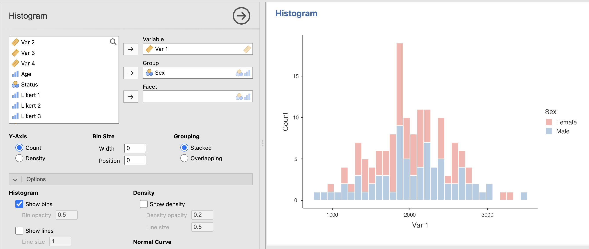

## Box Plot

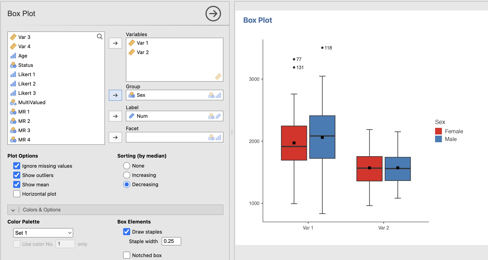

## Scatter Plot

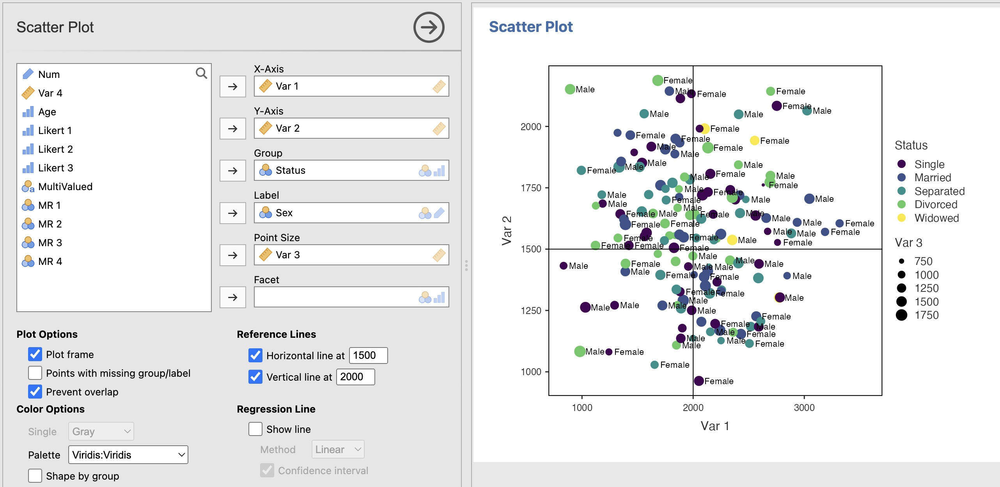

## Bar Chart (for quantitative variables)

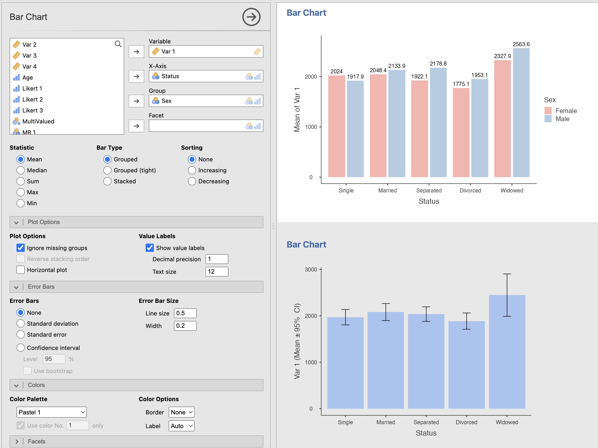

## Lollipop Plot

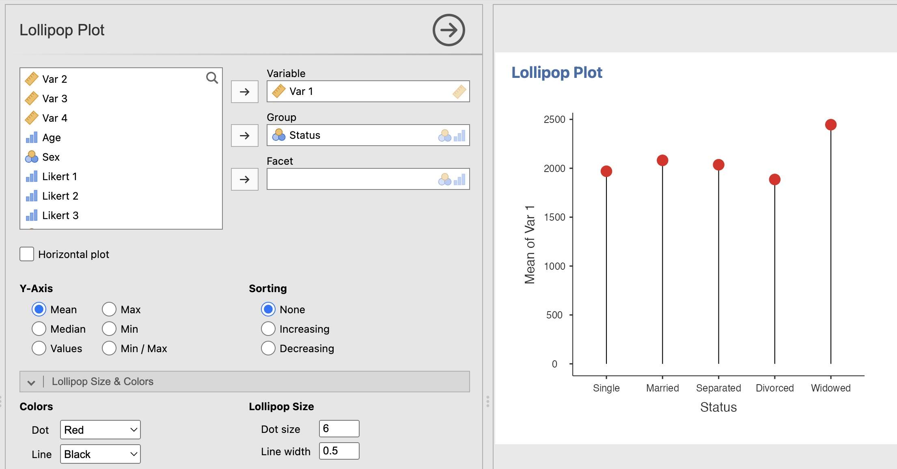

## Raincloud Plot

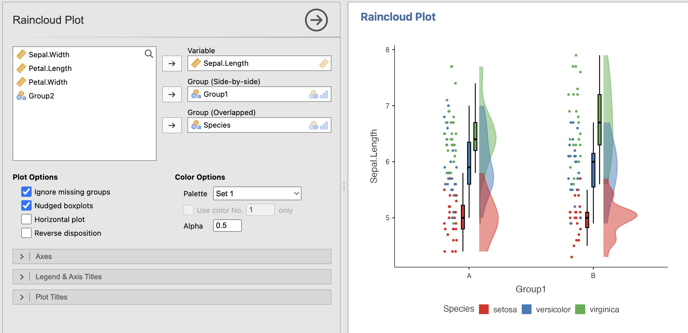

## QQ Plot

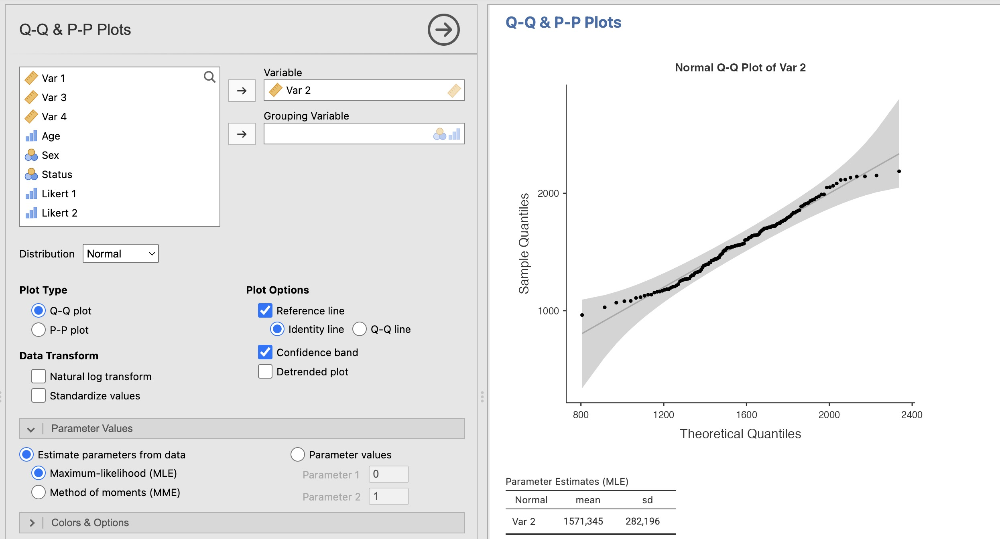

## Bar Plot (for qualitative variables)

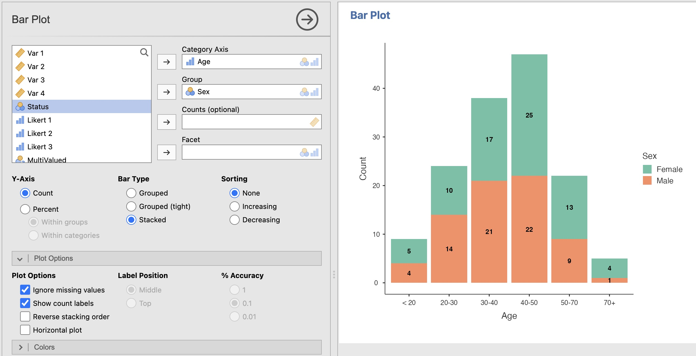

## Pie Chart

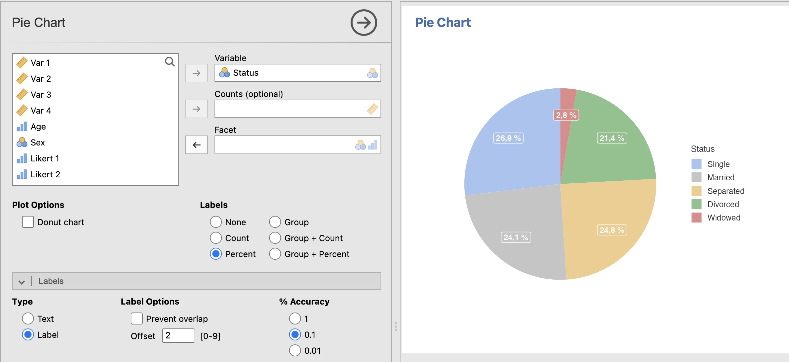

## Mosaic Plot

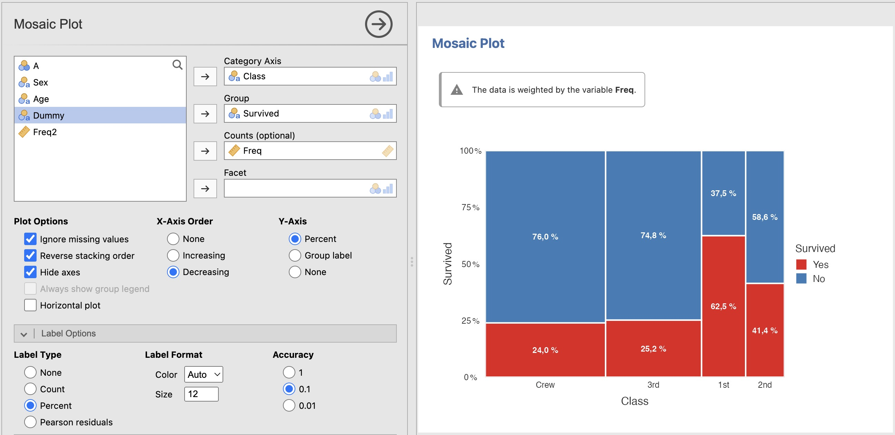

## Likert Plot

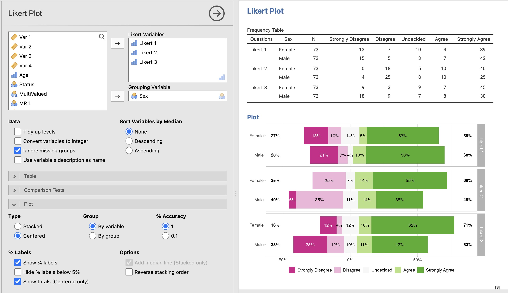

## Multiple Responses

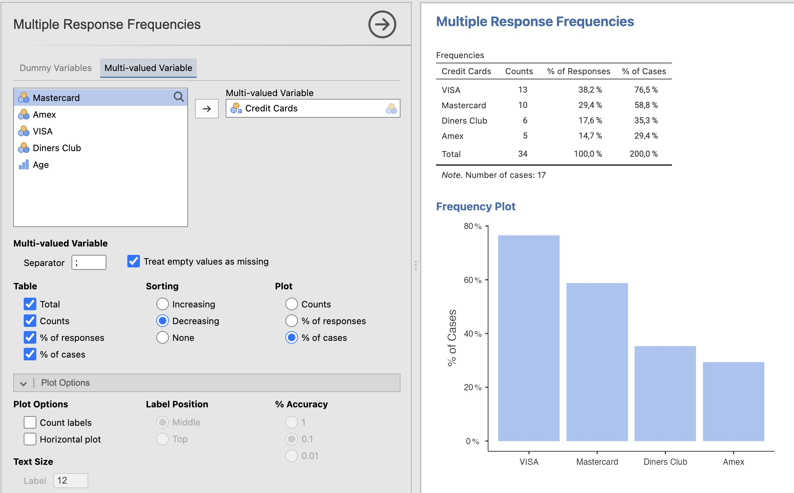

## Line Charts

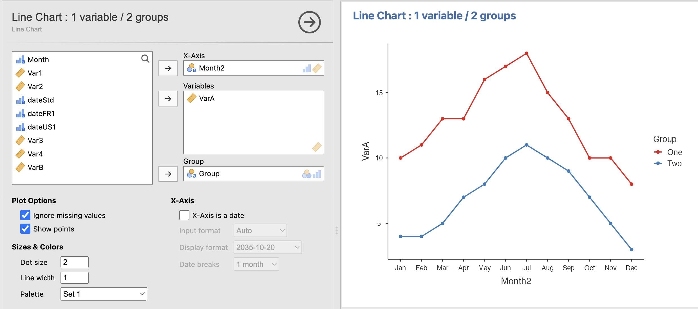

## Area Chart

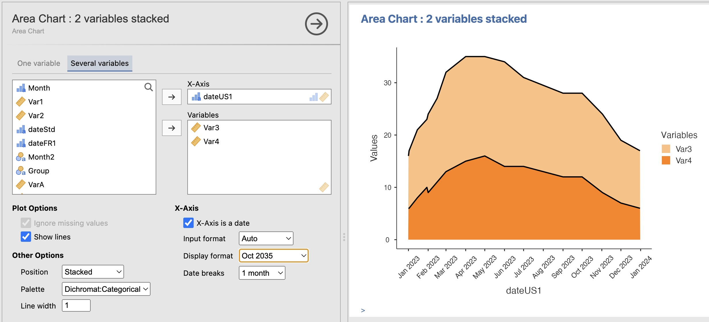

## Principal Component Analysis

## Correspondence Analysis

## Multiple Correspondence Analysis

## Last changes

- Mosaic Plot
- Multiple Response Plots: the "Counted value" option now accepts any text (e.g. Y/N)
- Improved error handling
- Code optimization and fixes everywhere
- MCA (Burt method): Fixed variable discrimination computation
- Histogram: Stacking group densities and normal curves when Grouping:stacked option is selected
- Histogram: Options to hide bins and to show lines
- Scatter Plot: Option to use different shapes. Option to set label text size
- Fixed stacking order in barplot/barchart/mrcrosstab
- Support for weights in barplot/piechart
- Improved ggplot2 4.0 support

## References

- Larmarange J. (2025). ggstats: Extension to 'ggplot2' for Plotting Stats. R package version 0.8.0, <https://github.com/larmarange/ggstats>.
- Almeida, A., Loy, A., Hofmann, H. (2023). qqplotr: Quantile-Quantile Plot Extensions for 'ggplot2'. R package version 0.0.6, <https://github.com/aloy/qqplotr>.
- Bernaards, C., Gilbert, P., Jennrich, R. (2025), GPArotation: Gradient Projection Factor Rotation. R package version 2025.3.1, <https://cran.r-project.org/package=GPArotation>.
- Greenacre, M. (2010), Biplots in Practice, Fundación BBVA. <https://www.fbbva.es/en/publicaciones/biplots-in-practice-7/>.
- Husson, F., Josse, J., Le, S., Mazet, J. (2025). FactoMineR: Multivariate Exploratory Data Analysis and Data Mining. R package version 2.12, <https://cran.r-project.org/package=FactoMineR>
- Engler, J.B. (2026). tidyplots: Tidy Plots for Scientific Papers, R package version 0.4.0, <https://CRAN.R-project.org/package=tidyplots>
