# vijPlots

A [jamovi](https://www.jamovi.org) module. Main statistical charts, all built with **ggplot2** and offering extensive customization options:

- **Continuous variables**: Histogram, Box plot, Raincloud plot, Scatter plot, Error bar chart, Lollipop plot, QQ plot
- **Categorical variables**: Bar plot, Pie chart, Mosaic plot, Likert plot
- **Time series**: Line chart, Area chart
- **Multiple Response**: Frequencies, Crosstab

The module is available in the **Plots** tab.

## Histogram

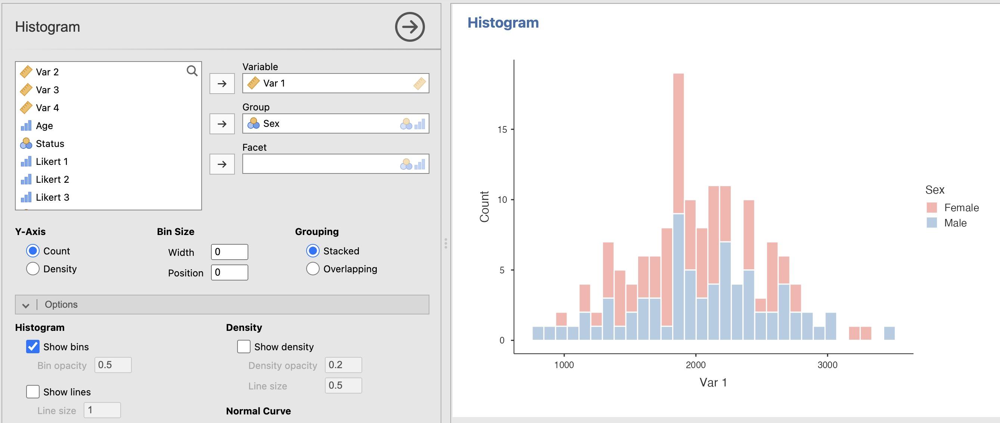

## Box Plot

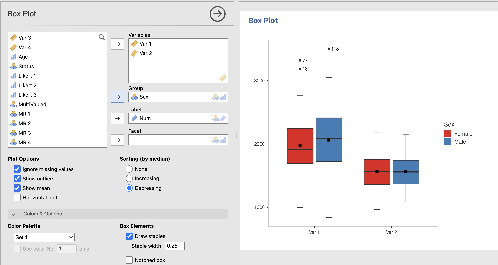

## Scatter Plot

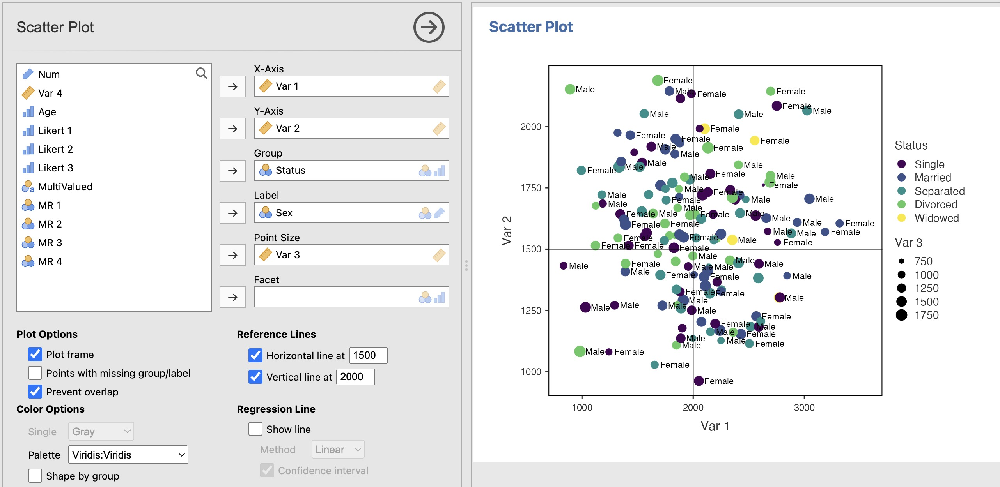

## Bar Chart (for quantitative variables)

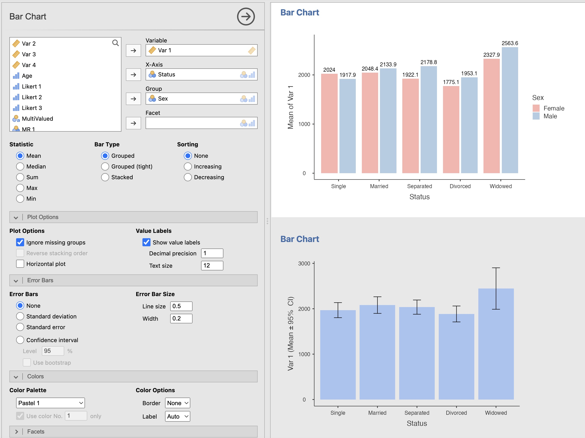

## Lollipop Plot

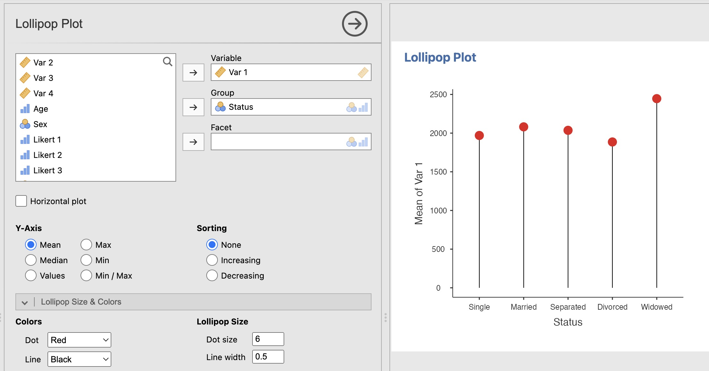

## Raincloud Plot

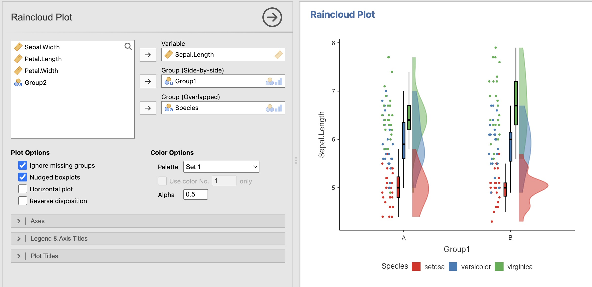

## QQ Plot

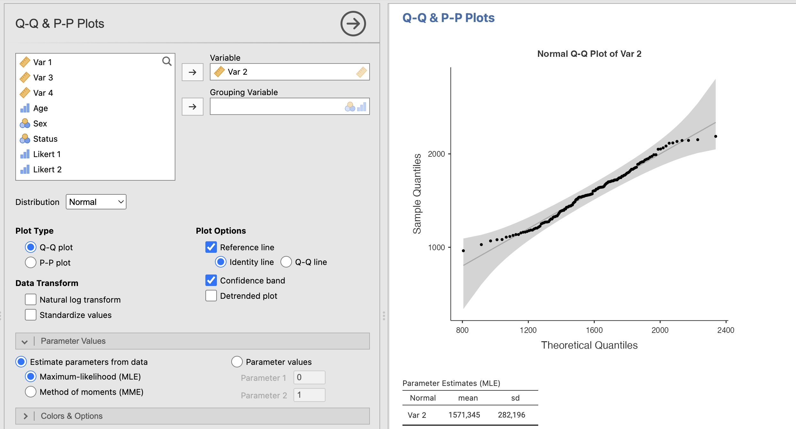

## Bar Plot (for qualitative variables)

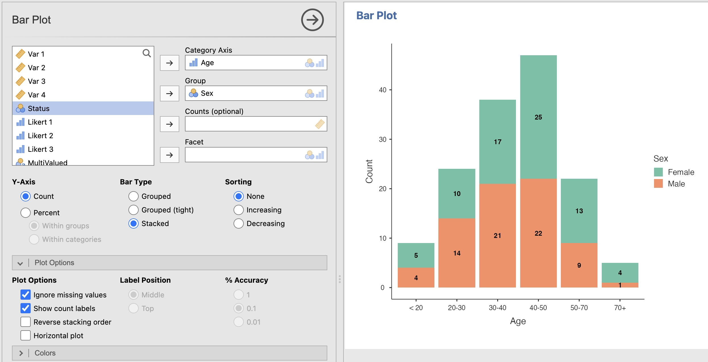

## Pie Chart

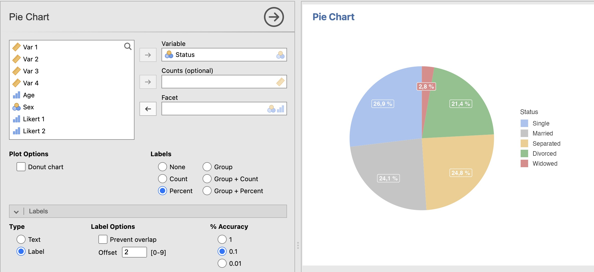

## Mosaic Plot

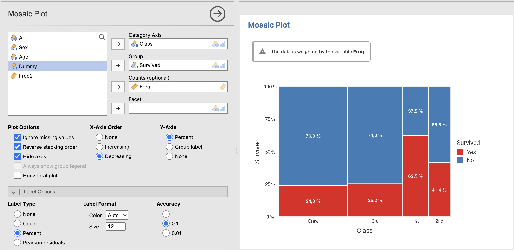

## Likert Plot

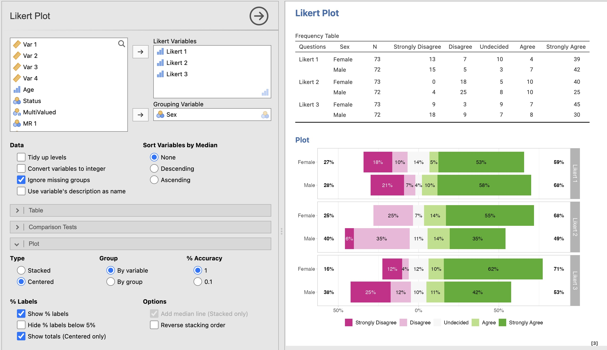

## Multiple Responses

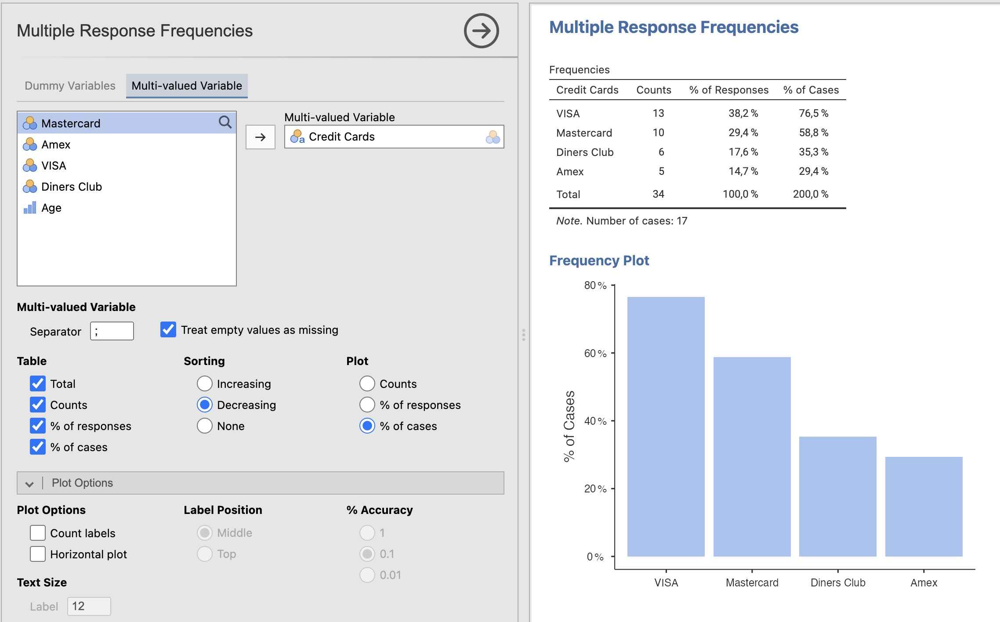

## Line Charts

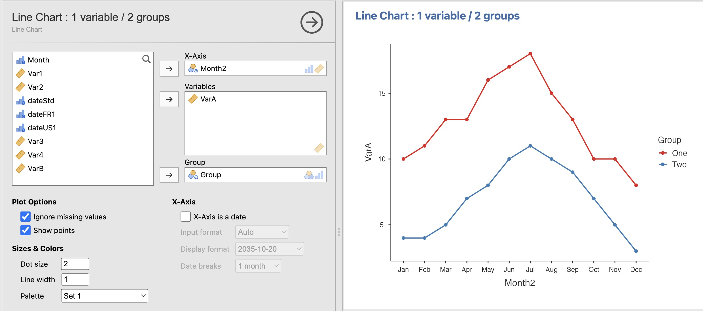

## Area Chart

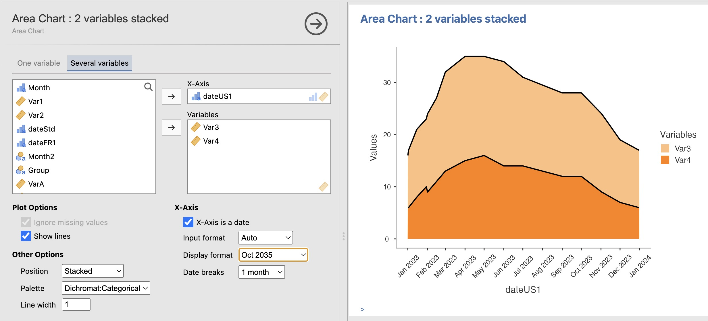

## Last changes: vijPlots 1.3.3 (2026-10-04)

* Clockwise option added to piechart

## References

- Larmarange J. (2026). ggstats: Extension to 'ggplot2' for Plotting Stats. R package version 0.13.0, <https://github.com/larmarange/ggstats>
- Almeida, A., Loy, A., Hofmann, H. (2025). qqplotr: Quantile-Quantile Plot Extensions for 'ggplot2'. R package version 0.0.7, <https://github.com/aloy/qqplotr>
- Engler, J.B. (2026). tidyplots: Tidy Plots for Scientific Papers, R package version 0.4.0, <https://CRAN.R-project.org/package=tidyplots>
- IBM. Carbon Design System — Color palettes. <https://carbondesignsystem.com/data-visualization/color-palettes/>

